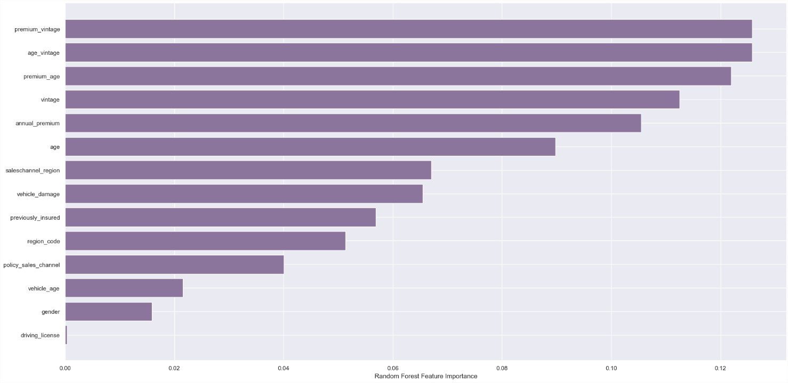

<h1 align="center"> HEALTH INSURANCE CROSS SELL PREDICTION</h1>
<h6 align="center"> This project was based on a fictional company</h6>

This is a study project that aims to calculate the propensity of purchasing car insurance, considering pre-existing data from health insurance.

As a result, an interactive spreadsheet (GoogleSheets) was created that returns the propensity of each customer to purchase car insurance. With the savings generated by calling only the customers indicated by the model as being inclined to purchase car insurance, the profit increases by 72%.

&nbsp; 

The spreadsheet is available at: [GoogleSheets](https://docs.google.com/spreadsheets/d/1VXncUpobjJoljO2OOjRmPXnLmHiRKe9GJPCUyDYZa8A/edit#gid=0)

&nbsp; 

----------------------------

**<h2> 1 - Business Problem </h2>**

**<h2> 1.1 - About Golden Shield </h2>**

Golden Shield is a reputable insurance company that has been providing reliable coverage to its customers since 1984. Founded that year by a group of industry experts, the company has grown to become a leading provider of insurance products in the market. In the early days, Golden Shield focused on offering basic coverage for **life, health, and property** insurance.  

Over the years, Golden Shield has continued to evolve and adapt to changing market conditions. The company has invested heavily in technology and innovation, allowing it to streamline its operations and offer more efficient and effective services to customers. At the same time, Golden Shield has maintained a strong focus on the fundamentals of insurance, such as risk assessment, underwriting, and claims management, to ensure that it remains a reliable and trustworthy partner for its customers. 

Today, Golden Shield aims to maximize its revenue and has decided to start selling **vehicle insurance**. To reduce the **Customer Acquisition Cost (CAC)**, the company will adopt a **cross-selling strategy** by offering it to existing clients.

&nbsp; 

**<h2> 1.2 - The business problem </h2>**

For a more effective campaign, Golden Shield has decided to recommend vehicle insurance only to the clients who are **most likely to be interested in it**. This will enable the call center to make **targeted calls**to potential clients who are more likely to purchase car insurance. As a data scientist at Golden Shield, the task is to develop a ***predictive model to determine a customer's propensity to buy vehicle insurance***.

&nbsp; 

-------------------

**<h2> 2 - Solution Strategy </h2>**
In this project will be used the Cross Industry Standard Process for Data Mining or CRISP-DM is an open standard process framework model for data mining project planning.

&nbsp; 

Every step od CRISP-DM wil be discribe bellow.

The codes of this project is available at: [notebook](notebooks/pa_004.ipynb)

&nbsp; 

**<h2> 2.1 - Business Understanding </h2>**

The first step in this project is to select a sample of customers and survey them to determine their interest in the new product. Using this data, we can develop a model to predict each customer's propensity to buy car insurance.

Additionally, some preliminary research on the insurance market has been conducted to gain insights into the industry trends and customer behavior. The results of this research are documented in a notebook and will be used to inform the development of the model.

As this is a research project, response data has already been obtained from interested customers, which is ready to be used to develop the model. However, in order to do so, the data had to be collected in a SQL database.

&nbsp; 

**<h2> 2.2 - Data Understanding </h2>**

In this steps will be collected the data, and checked the following:

* Data description
* Exploratory data analisys and hypothesis validation

&nbsp;

**<h2> 2.2.1 - Collecting data into an SQL database </h2>**
To collect the data, a connection will be made to the SQL database, specifically the PostgreSQL database used by Golden Shield company. A Python library that can convert SQL queries into pandas dataframes will then be used, allowing for easy manipulation and analysis of the data.

&nbsp; 

&nbsp; 

**<h2> 2.2.2 - Data Description </h2>**

&nbsp;

|         Name         |                          Meaning                          |
|:--------------------:|:---------------------------------------------------------:|
| id                   | Unique ID per customer                                    |
| gender               | Customer gender                                           |
| age                  | Age                                                       |
| region_code          | Region code                                               |
| policy_sales_channel | Code for customer contact channels                        |
| driving_license      | If the customer has a driver's license                    |
| vehicle_age          | Vehicle age                                               |
| vehicle_damage       | If the vehicle has been damaged before                    |
| previously_insured   | If the customer already has car insurance                 |
| annual_premium       | Customer's annual health insurance premium                |
| vintage              | Number of days the customer has had the health insurance  |
| response             | Customer response regarding interest in vehicle insurance |

&nbsp;

**<h2> 2.2.2 - Exploratory Data Analisys and Hypotesis validation </h2>**

During exploratory data analysis, several types of analyses are conducted, including descriptive statistics, univariate, bivariate, and multivariate analysis. The main objective is to gain a better understanding of the data and customer behavior, as well as to extract business insights.

&nbsp;

**Top Insights:**

 The channel that is most frequently used (152) to contact customers has a low conversion rate, while the second (26) and third (124) most used channels have a good conversion rate. In order to improve the conversion rate, there are some changes that can be implemented such as applying the techniques used in channels 26 and 124 to channel 152, and encouraging customers to migrate to other channels to reduce the demand for the most used channel.

&nbsp;

Clients with vehicles with less than 1 year has the lower convertion rate. That suggest some expecific marketing campain or an different approach.

&nbsp;

**<h2> 2.3 - Data Preparation </h2>**

**<h2> 2.3.1 - Feature Engineering </h2>**

The objective of feature engineering is to transform and create new features from existing data in order to improve the performance of machine learning models. In this step, new features are created by applying mathematical operations or by combining existing features in a meaningful way.

After creating these new features, they are added to a Pipeline object which defines a sequence of data processing steps to be applied to the input data. This ensures that the feature engineering steps are automatically applied along with any other necessary preprocessing steps when the final model is trained and evaluated.

&nbsp;

&nbsp;
The codes for this pipeline is available at:
[FeatureEngineering](pipeline/feature_engineering.py)

&nbsp;

**<h2> 2.3.2 - Feature Selection </h2>**

Feature selection is the process of selecting a subset of relevant features (variables) from the original set of features that are used to train a machine learning model. The goal is to identify the most important features that have a significant impact on the model's performance.

After analyzing the results of feature importance and gaining insights from exploratory data analysis, I decided to include all the features in the model.

&nbsp;

&nbsp;

**<h2> 2.3.3 - Pre-processing </h2>**

Pre-processing refers to the set of steps that are taken to prepare the data for the machine learning model. These steps involve transforming the data, such as dealing with missing values, scaling or normalizing the features, and encoding categorical variables.

Similar to feature engineering, the pre-processing steps are also added to a Pipeline object, which allows them to be applied in a systematic and automated way in the final model.

&nbsp;

&nbsp;

**<h2> 2.4 - Modeling </h2>**

In this step, was taken the best-performing models and optimize their parameters using Bayesian Search technique. To fine-tune the hyperparameters more accurately, was created a custom version of BayseanSearchCV that optimizes the parameters using a stratified cross-validation technique. This is particularly useful in cases where the target feature is imbalanced, as it ensures that each fold of the cross-validation contains a representative sample of the minority class.

The code of the customized BayesSearchCV can be seen in this [link](bayesian/bayesian.py)

**<h2> 2.4.1 - Machine Learning Modeling </h2>**
Cumulative Gains Curve: is a visualization tool used in marketing and business analytics to evaluate the effectiveness of a model or a marketing campaign. It shows the proportion of the total positive outcomes achieved by targeting a specific percentage of the population.

&nbsp;

Lift Curve: is a graphical representation that shows the effectiveness of a predictive model in comparison to a random guess. It is commonly used in marketing and customer relationship management to evaluate the performance of models designed to predict customer behavior.

&nbsp;

Based on those curves, two models are selected:

* LGBMClassifier
* CatBoostClassifier

&nbsp;

**<h2> 2.4.2 - Cross-Validation </h2>**

LGBM

   

&nbsp;

CatBoost 

  

&nbsp;

**<h2> 2.4.3 - Hyperparameter Finetuning </h2>**

After use BayseanSearchCV, the best parameters was seted into the model and after that puted into a pipeline object.

LGBM

&nbsp;

Catboost

&nbsp;

**<h2> 2.4.4 - Pipeline and Final Model </h2>**
To develop a more robust and accurate model, an ensemble technique was used, specifically Bagging. This technique involves building multiple models independently and combining their predictions. The goal was to reduce variance and increase stability, ultimately improving the overall performance of the model.

With all the results from the previous steps, the final model was developed. Once the model was trained and deployed in the production environment, the Golden Shield can start calling the selected customers.

&nbsp;

**<h2> 2.5 - Evaluation - Business Performance </h2>**

To evaluate the business performance, was developed a code that calculates the percentage of customers to contact, the minimum score, and the difference in profits between the traditional method and using the model.

The evaluation is based on the price of the product and the cost of the operation per customer. And need the list of customers ordered by the score of the model.

* Vehicle Insurance Price: $550.00
* Cost to call to customer: $40.00

Minimum Score

In this example is recommended call to 46% of customers ordered by score model. That is the customer's score (threshold) has to be more than 0.17.

&nbsp;

The difference in profit between traditional way, and using the model

By targeting only the customers most likely to purchase, the company can reduce the cost of unnecessary calls. The resulting cost savings make the operation 72.38% more profitable.

&nbsp;

**<h2> 2.6 - Deployment </h2>**

The final product is a spreadsheet document linked to the deployed machine learning model. This document provides a list of customers likely to purchase car insurance, based on the predictions made by the model.

&nbsp;

To get the predictions, just nedd to input the customer data, click on "Health Insurance Prediction" - "Get Prediction". Than the sheet will connect with the deployed model and return the score, with the prediction, the customers tha should recieve the offer will be highlighted. 

&nbsp;

------------------------

**<h2> 3. Next Steps </h2>**
* Collect new data, to improve model performace;
* Explore different combination of feature;
* Avaliate the sales_channel_region and region_code, for better campaign; 
* Cluster customers into segments for a more targeted and personalized campaign.

&nbsp;

------------------------

**<h2> 4. Technologies </h2>**

&nbsp;
_____________

**<h2> 5. Author </h2>**

Ivelise V. Rondina

Data Scientist

[Project Portfolio](https://iveliserondina.github.io/portfolio/)

[GitHub Profile](https://github.com/IveliseRondina)
